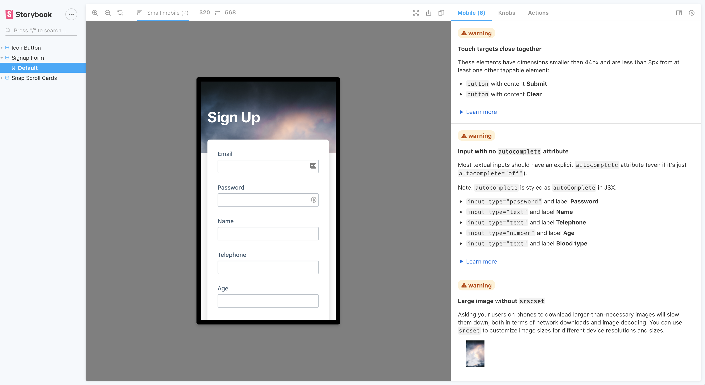

# 📱storybook-mobile-addon

This addon offers suggestions on how you can improve the HTML, CSS and UX of your components to be more mobile-friendly.

<a href="https://storybook-mobile.netlify.app/?path=/story/signup-form--default" alt="screenshot of storybook-mobile addon">
    
</a>

[To see all available suggestions, check out a live storybook demo here.](https://storybook-mobile.netlify.app/?path=/story/signup-form--default)

## Versions

- 4.x.x is for Storybook `>=9.0.0`
- 3.1.x is for Storybook `>=8.2.0`
- 3.0.x is for Storybook `>=8.0.0`
- 2.x is for Storybook `>=7.0.0`


## Quick Start

`npm install --save-dev storybook-mobile-addon`

Next, add `storybook-mobile-addon` to your list of addons:

`.storybook/main.js`

```diff
module.exports = {
  // other config goes here
  addons: [
+    'storybook-mobile-addon'
  ],
}
```

This addon works best when you set mobile-sized [viewports](https://storybook.js.org/docs/essentials/viewport) in your `preview.ts`.

## Contributing

If you have any suggestions or find any bugs, please make an issue or a pr!
